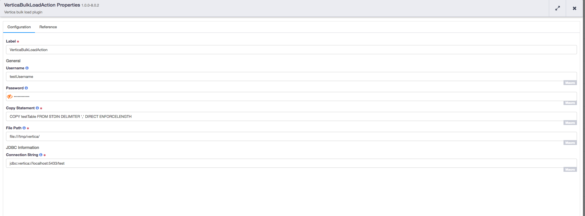

[](https://travis-ci.org/hydrator/vertica-db-plugins) [](https://opensource.org/licenses/Apache-2.0)

Vertica Bulk Load Action
========================

CDAP Plugin for bulk loading into Vertica Database. 




Usage Notes
-----------

This plugin is configured to go through all the files inside directory and do bulk load into vertica database.

Plugin Configuration
---------------------

| Configuration | Required | Default | Description |
| :------------ | :------: | :----- | :---------- |
| **user** | **N** | N/A | This configuration specifies user name for vertica database
| **password** | **N** | N/A | This configuration specifies password for vertica database
| **copyStatement** | **Y** | N/A | This configuration specifies copy statement for vertica database
| **path** | **Y** | N/A | This configuration provides directory which has all the files to be loaded to vertica database
| **connectionString** | **Y** | N/A | This configuration provides connection string for vertica database


Build
-----
To build this plugin:

```
   mvn clean package
```    

The build will create a .jar and .json file under the ``target`` directory.
These files can be used to deploy your plugins.

Deployment
----------
You can deploy your plugins using the CDAP CLI:

    > load artifact <target/vertica-db-plugins-<version>.jar config-file <target/vertica-db-plugins-<version>.json>

For example, if your artifact is named 'vertica-db-plugins-<version>':

    > load artifact target/vertica-db-plugins-<version>.jar config-file target/vertica-db-plugins-<version>.json
    
## Mailing Lists

CDAP User Group and Development Discussions:

* `cdap-user@googlegroups.com <https://groups.google.com/d/forum/cdap-user>`

The *cdap-user* mailing list is primarily for users using the product to develop
applications or building plugins for appplications. You can expect questions from 
users, release announcements, and any other discussions that we think will be helpful 
to the users.

## IRC Channel

CDAP IRC Channel: #cdap on irc.freenode.net


## License and Trademarks

Copyright © 2017 Cask Data, Inc.

Licensed under the Apache License, Version 2.0 (the "License"); you may not use this file except
in compliance with the License. You may obtain a copy of the License at

http://www.apache.org/licenses/LICENSE-2.0

Unless required by applicable law or agreed to in writing, software distributed under the 
License is distributed on an "AS IS" BASIS, WITHOUT WARRANTIES OR CONDITIONS OF ANY KIND, 
either express or implied. See the License for the specific language governing permissions 
and limitations under the License.

Cask is a trademark of Cask Data, Inc. All rights reserved.

Apache, Apache HBase, and HBase are trademarks of The Apache Software Foundation. Used with
permission. No endorsement by The Apache Software Foundation is implied by the use of these marks.    
